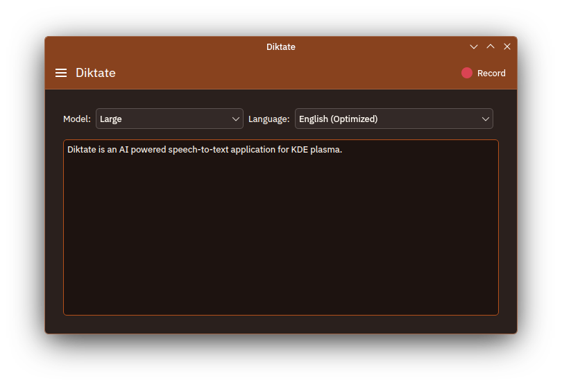

<div align="center">
  
  
  # Diktate
  
  **AI-powered speech-to-text application for KDE Plasma**
  
  A fast and private offline transcription tool using Whisper AI  
</div>

---

## About

Diktate is a native KDE application that provides accurate speech-to-text transcription using OpenAI's Whisper AI model. All processing happens locally on your device, ensuring your audio data remains completely private.

### Features

- **Offline transcription** - No internet connection required, your data never leaves your device
- **Multiple Whisper models** - Choose from tiny to large models based on your accuracy and speed needs
- **Easy model management** - Download and manage Whisper models directly from the app
- **GPU acceleration** - Optional CUDA and Vulkan support for faster transcription
- **Native KDE integration** - Built with Qt/QML and Kirigami for seamless Plasma desktop experience
- **Simple interface** - Record audio and get instant transcription with minimal clicks

## Installation

### Flathub (Recommended)

The easiest way to install Diktate is through Flathub:

[](https://flathub.org/apps/org.koderoots.diktate)

Or via command line:
```bash
flatpak install flathub org.koderoots.diktate
```

### Building from Source

For build instructions, see [BUILD.md](BUILD.md).

## Screenshots



## Usage

1. Launch Diktate from your application menu
2. On first run, download a Whisper model (start with "base" for good balance of speed and accuracy)
3. Click the microphone button to start recording
4. Speak clearly into your microphone
5. Click stop when finished
6. View your transcription instantly

## License

This project is licensed under the GPL-3.0 License - see the LICENSE file for details.

## Credits

- Built with [whisper.cpp](https://github.com/ggerganov/whisper.cpp) - High-performance inference of OpenAI's Whisper
- Powered by [OpenAI Whisper](https://github.com/openai/whisper) - Robust speech recognition model
